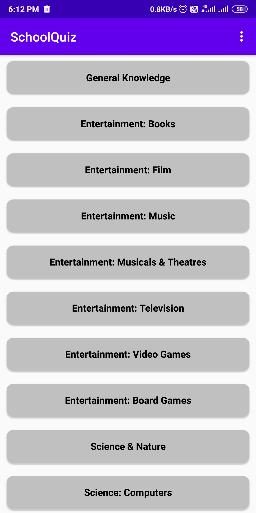
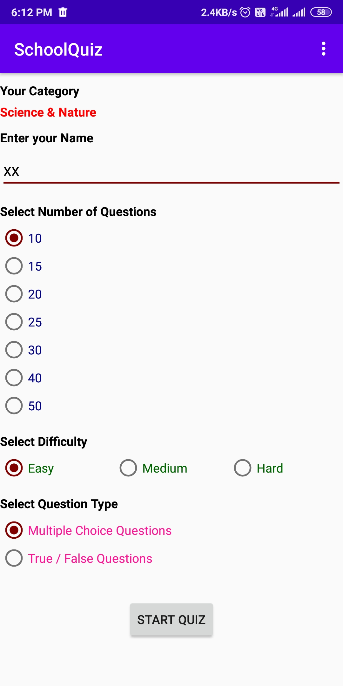
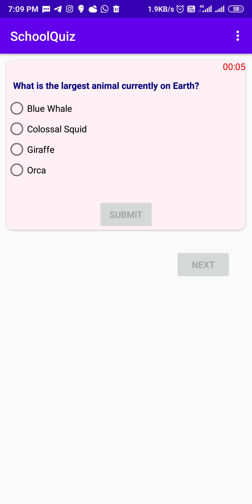
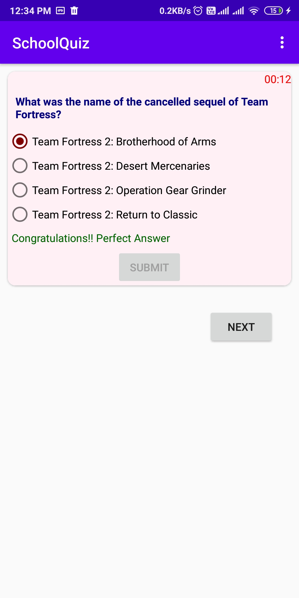
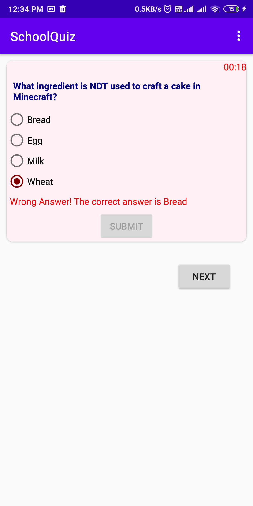
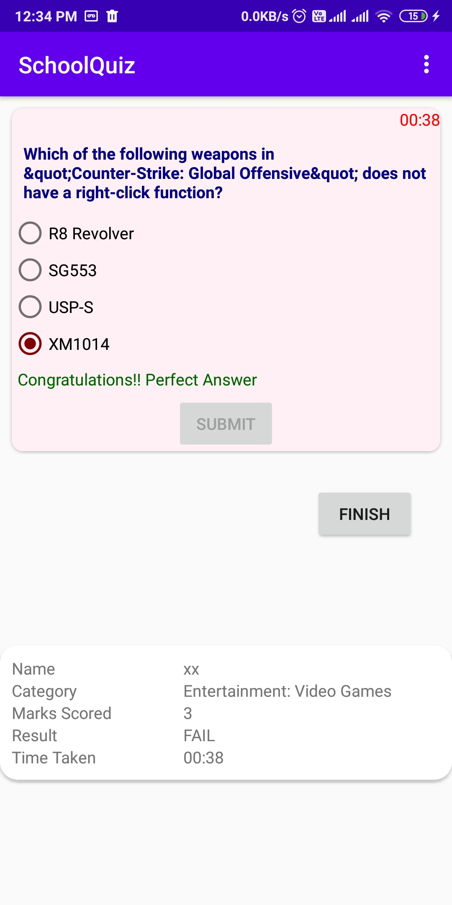

# SchoolQuiz
This Quiz app has lot of questions under various categories.

1.Category Screen:

2.Quiz Parameters Screen:

3.Quiz Screen:
  a.Question:

  b.Correct Answer:

  c.Wrong Answer:
  

  d.Final Result:
  

